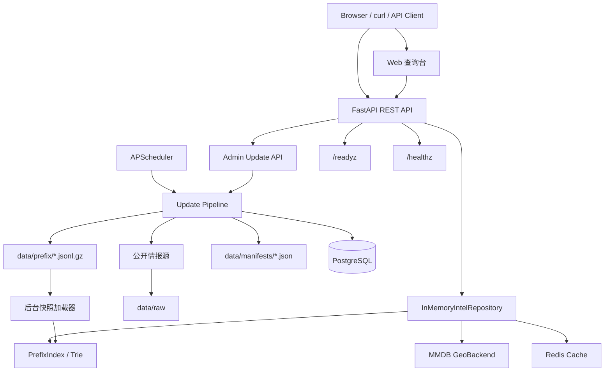
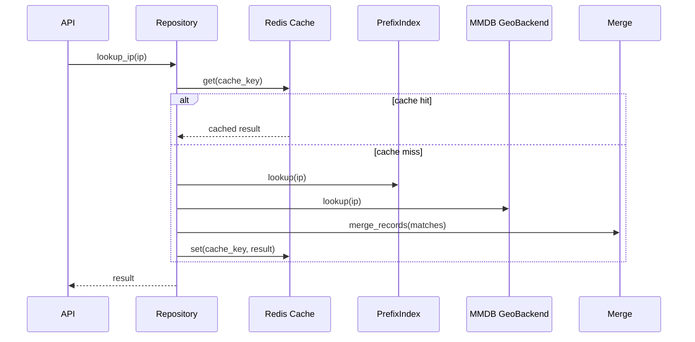

# IPAtlas 项目模块说明书

本文按模块讲解 IPAtlas 的代码结构、运行链路、数据流和扩展方式，适合新接手项目时快速建立整体认识。

## 1. 项目总览

IPAtlas 是一个本地 IP 情报查询 Web 服务。它把公开或商业 IP 情报源下载到本地，规范化为 CIDR/IP 段记录，启动时构建本地查询索引，并通过 Web UI 和 REST API 提供单 IP、批量 IP、CIDR、IP 范围、ASN 查询能力。

核心思路：

- 不按每个 IP 存一条记录，而是按 IP 段/CIDR 保存。
- 地理位置使用 MMDB 查询，当前默认是 DB-IP City Lite。
- ASN、RIR、云厂商网段使用规范化前缀快照 `data/prefix/*.jsonl.gz`。
- 查询主路径是内存前缀索引 + MMDB，PostgreSQL 和 Redis 都是辅助组件。
- 服务启动时先可访问，前缀快照在后台加载；加载状态通过 `/readyz` 查看。

整体架构：



## 2. 目录结构

```text
IPAtlas/
  app/
    api/       REST API 路由、请求模型、依赖注入
    core/      配置、安全、健康检查相关基础设施
    db/        SQLAlchemy 模型、数据库初始化、元数据写入
    intel/     IP 解析、前缀索引、查询仓库、结果合并、缓存、MMDB
    sources/   情报源适配器、下载解析、快照读写
    tasks/     更新任务和定时调度
    web/       查询台 HTML/CSS/JS
  data/        本地情报数据，较大文件一般被 .gitignore 忽略
  tests/       单元测试和 API 测试
  docs/        项目说明文档
```

重要入口：

- `main.py`：CLI 入口，支持 `serve` 和 `update`。
- `app/main.py`：FastAPI 应用入口，负责生命周期、Web 静态文件和后台快照加载。
- `app/api/routes.py`：所有公开 REST API。
- `app/intel/repository.py`：查询主入口，封装内存索引、MMDB、Redis 缓存和数据源切换。
- `app/tasks/update.py`：统一更新入口，连接 API/CLI 与各情报源适配器。

## 3. API 模块：`app/api`

API 模块负责把 HTTP 请求转换为内部查询或更新调用。

主要文件：

- `routes.py`：注册所有路由。
- `schemas.py`：定义批量查询、范围查询等请求模型。
- `deps.py`：从 `app.state` 中取出全局 `InMemoryIntelRepository`。

主要接口：

- `GET /healthz`：存活检查，只表示进程可响应。
- `GET /readyz`：就绪检查，返回索引、MMDB、前缀快照、PostgreSQL、Redis 状态。
- `GET /v1/ip/{ip}`：单 IP 查询。
- `POST /v1/ip/batch`：批量 IP 查询。
- `GET /v1/cidr/{cidr}`：CIDR 覆盖记录查询，支持 `limit` / `offset`。
- `POST /v1/range`：IP 范围覆盖记录查询，支持 `limit` / `offset`。
- `GET /v1/asn/{asn}`：ASN 相关前缀查询，支持 `limit` / `offset`。
- `GET /v1/meta/sources`：当前数据源元信息。
- `POST /v1/admin/update/{source_name}`：更新指定源。
- `POST /v1/admin/update/all`：按顺序更新全部公开源。

API 层不直接理解每个情报源的格式，也不直接操作底层 trie；这些能力都通过 repository 和 update pipeline 完成。

## 4. 核心配置模块：`app/core`

`app/core` 放项目基础设施，不包含业务查询逻辑。

主要文件：

- `config.py`：使用 `pydantic-settings` 读取环境变量。
- `security.py`：校验 admin API 的 `x-admin-token`。
- `readiness.py`：检查 PostgreSQL 和 Redis 是否可用。

常见配置：

- `IPATLAS_DATA_DIR`：数据目录，默认 `./data`。
- `IPATLAS_ADMIN_TOKEN`：admin API token，默认 `change-me`。
- `IPATLAS_DATABASE_URL`：PostgreSQL 连接地址。
- `IPATLAS_REDIS_URL`：Redis 连接地址。
- `IPATLAS_LOOKUP_CACHE_TTL_SECONDS`：Redis 查询缓存 TTL。
- `IPATLAS_QUERY_DEFAULT_LIMIT`：CIDR/range/ASN 查询默认返回数量。
- `IPATLAS_QUERY_MAX_LIMIT`：CIDR/range/ASN 单次最大返回数量。
- `IPATLAS_ENABLE_SCHEDULER`：是否开启定时更新。
- `IPATLAS_SYNC_PREFIX_RECORDS_TO_DATABASE`：是否把前缀记录同步到 PostgreSQL。

## 5. 查询核心模块：`app/intel`

`app/intel` 是项目最核心的一层，负责把各种数据源查询结果合并成最终响应。

### 5.1 类型定义：`types.py`

核心类型：

- `SourceInfo`：数据源元信息，例如名称、类型、版本、license、更新时间、记录数。
- `PrefixRecord`：标准化前缀记录，包含网络段、来源、来源类型、置信度和情报字段。

当前来源优先级：

```text
manual_override > commercial_risk > cloud > asn > rir > geo > seed
```

同一个字段被多个源命中时，优先级高的源会先占用该字段；不同字段可以来自不同数据源。

### 5.2 IP 工具：`ip_utils.py`

负责：

- 解析 IPv4/IPv6。
- 解析 CIDR。
- 解析 start/end IP 范围。
- 把 IP 范围拆成 CIDR 列表。
- 标记私有地址、保留地址、loopback、global 等基础属性。

### 5.3 前缀索引：`prefix.py`

实现 IPv4/IPv6 分离的二叉 trie，用于 longest-prefix match。

特点：

- 插入单位是 `PrefixRecord`。
- 查询时返回所有匹配前缀，再按 source priority、prefix length、confidence 排序。
- 查询主路径不扫描完整数据集。

### 5.4 查询仓库：`repository.py`

`InMemoryIntelRepository` 是 API 层最重要的依赖。

它负责：

- 维护当前内存前缀记录和 `PrefixIndex`。
- 维护 ASN 二级索引，避免 `/v1/asn/{asn}` 扫描全部前缀记录。
- 查询 MMDB 地理库。
- 查询 Redis 缓存。
- 合并所有命中记录。
- 原子替换单个 source 或多个 source。
- 暴露前缀快照后台加载状态。

CIDR、range 和 ASN 查询都会返回分页元信息：

- `total_count` / `record_count`：总命中数。
- `returned_count`：本次返回条数。
- `limit` / `offset`：分页参数。
- `truncated`：是否还有未返回记录。

单 IP 查询流程：



### 5.5 结果合并：`merge.py`

`merge_records()` 接收多个 `PrefixRecord`，按优先级选择每个字段的最终值。

如果请求带 `include_sources=true`，响应会额外返回：

- `field_sources`：每个字段来自哪个 source、CIDR、版本、置信度。
- `matches`：所有命中记录摘要。

### 5.6 地理库：`geo.py`

`MmdbGeoBackend` 负责读取 DB-IP City Lite MMDB。

它会：

- 启动时加载 `data/dbip-city-lite.mmdb`。
- 读取 `data/dbip-city-lite.manifest.json`。
- 对 DB-IP MMDB 字段做标准化。
- 返回 geo 类型的 `PrefixRecord`。

### 5.7 Redis 缓存：`cache.py`

Redis 只缓存热点单 IP 查询结果，不作为正确性依赖。

缓存 key 包含：

- prefix source 版本 token。
- geo backend 版本 token。
- 是否包含来源详情。
- IP 字符串。

任一 source 更新成功后会清理旧缓存。

## 6. 情报源模块：`app/sources`

`app/sources` 负责把外部数据源转换为统一的 `PrefixRecord`。

### 6.1 通用前缀源框架：`base.py`

通用流程：

```text
download -> parse -> normalize -> smoke test -> write snapshot -> write manifest
```

输出位置：

- 原始文件：`data/raw/<source>/`
- 规范化快照：`data/prefix/<source>.jsonl.gz`
- manifest：`data/manifests/<source>.json`

启动时 `load_prefix_snapshots()` 会读取 `data/prefix/*.jsonl.gz`，重建内存索引。

### 6.2 DB-IP 地理源：`dbip_lite.py`

负责：

- 发现 DB-IP City Lite 当前 release。
- 下载 `.mmdb.gz`。
- 校验 MD5/SHA1。
- 解压到 staging 文件。
- smoke test 后原子替换 `data/dbip-city-lite.mmdb`。
- 写入 `data/dbip-city-lite.manifest.json`。

DB-IP 是 MMDB 源，不会被转换成 `data/prefix/*.jsonl.gz`。

### 6.3 本地 JSON 源：`local_json.py`

支持用户手动维护覆盖规则，例如：

```text
data/manual-lab.json
```

默认 source type 是 `manual_override`，优先级最高，适合修正错误情报或添加内部网段标注。

### 6.4 ASN 源：`iptoasn.py`

源名：`iptoasn-combined`

数据来源：IPtoASN TSV gzip。

输出字段：

- `asn`
- `as_name`
- `as_country`
- `routed`

解析时会把 start/end IP range 转成 CIDR 列表。

### 6.5 RIR 源：`rir_delegated.py`

源名：`rir-delegated`

支持：

- ARIN
- RIPE NCC
- APNIC
- LACNIC
- AFRINIC

输出字段：

- `rir`
- `allocation_country`
- `allocation_status`
- `allocated_at`
- `registry_resource_type`
- `registry_resource_id`

### 6.6 云厂商源：`cloud_ranges.py`

支持源：

- `cloud-aws`
- `cloud-google`
- `cloud-azure`
- `cloud-cloudflare`
- `cloud-github`

统一输出字段：

- `provider`
- `service`
- `region`
- `network_type`
- `hosting=true`

Azure 默认通过 Microsoft 下载页发现最新 Service Tags JSON；如果本地 CA 环境导致证书校验失败，可以通过配置覆盖 URL 或临时设置 `IPATLAS_AZURE_VERIFY_TLS=false` 验证链路。

### 6.7 源注册表：`registry.py`

`registry.py` 负责把 source name 映射到具体 adapter。

常量：

- `PREFIX_SOURCE_NAMES`
- `UPDATE_ALL_ORDER`
- `ASN_SOURCE_NAMES`
- `RIR_SOURCE_NAMES`
- `CLOUD_SOURCE_NAMES`

`update all` 的更新顺序是：

```text
rir -> asn -> cloud -> geo
```

## 7. 更新任务模块：`app/tasks`

### 7.1 更新入口：`update.py`

`update_source_from_local_file()` 是统一更新入口，支持：

- DB-IP MMDB 更新。
- 公开前缀源更新。
- 本地 JSON 源更新。

更新成功后会：

- 替换 repository 中对应 source 的记录。
- 写入 PostgreSQL 元数据。
- 可选同步 `ip_prefix_record`。
- 清理 Redis 查询缓存。

`update_all_sources()` 会按 `UPDATE_ALL_ORDER` 逐个更新，即使某个源失败，也会继续尝试后续源，并返回 `updated`、`partial` 或 `failed`。

### 7.2 定时任务：`scheduler.py`

当 `IPATLAS_ENABLE_SCHEDULER=true` 时启用 APScheduler。

当前策略：

- ASN 源：每 6 小时更新。
- RIR、cloud、DB-IP、本地 JSON：每 24 小时更新。

## 8. 数据库模块：`app/db`

PostgreSQL 是辅助存储，不是查询主路径。

主要职责：

- 创建基础表。
- 记录数据源和数据版本。
- 保存更新状态和错误信息。
- 可选批量同步 `ip_prefix_record`。

主要模型：

- `Source`
- `DatasetVersion`
- `IpPrefixRecord`
- `ManualOverride`

如果 PostgreSQL 不可用，服务会降级运行；`/readyz` 会显示 database 不可用，但 IP 查询仍可走本地索引和 MMDB。

## 9. Web 模块：`app/web`

Web 模块提供轻量查询台，不是营销页。

主要文件：

- `index.html`
- `static/app.js`
- `static/styles.css`

Web UI 支持：

- 单 IP 查询。
- 批量查询。
- CIDR 查询。
- JSON/表格结果展示。
- DB-IP attribution 展示。

## 10. 测试模块：`tests`

测试覆盖：

- API 路由。
- DB-IP 下载和 manifest。
- MMDB backend 字段规范化。
- 前缀匹配和字段合并。
- IPtoASN/RIR/cloud 源解析。
- 更新失败不切换旧索引。
- 启动不等待大前缀快照加载。

测试命令：

```bash
uv run pytest
```

`tests/conftest.py` 会隔离测试数据目录，并关闭测试中的 PostgreSQL 前缀同步，避免真实 `data/prefix/` 影响测试速度和稳定性。

## 11. 运行链路

### 11.1 服务启动

```text
uv run python main.py serve
```

启动流程：

1. 读取配置。
2. 创建数据目录。
3. 初始化 PostgreSQL 表；失败则降级。
4. 加载 DB-IP MMDB。
5. 初始化 Redis cache；失败则降级。
6. 用 seed 数据创建 `InMemoryIntelRepository`。
7. 后台线程加载 `data/prefix/*.jsonl.gz`。
8. 可选启动 scheduler。
9. FastAPI 开始响应请求。

因为前缀快照后台加载，服务会先可访问；可以通过 `/readyz` 看 `prefix_snapshots.status`。

### 11.2 单 IP 查询

```text
API -> Repository -> Redis cache -> PrefixIndex -> MMDB -> merge -> response
```

命中示例：

- cloud 源提供 `provider`、`hosting`。
- ASN 源提供 `asn`、`as_name`。
- RIR 源提供 `allocation_country`、`allocation_status`。
- geo 源提供 `country`、`city`、`latitude`、`longitude`。

### 11.3 情报源更新

CLI：

```bash
uv run python main.py update all
```

CLI 更新命令使用轻量 repository，不会在执行前预加载全部 `data/prefix/*.jsonl.gz`。更新单个源时只解析和 smoke test 新源数据；`update all` 会在同一进程里逐个把新源切换进内存索引。

API：

```bash
curl -X POST "http://127.0.0.1:8000/v1/admin/update/all" \
  -H "x-admin-token: change-me"
```

更新流程：

```text
discover/download -> verify -> parse -> normalize -> smoke test
  -> write raw/snapshot/manifest -> replace source -> clear cache -> record metadata
```

## 12. 扩展新情报源

新增前缀型情报源建议按以下步骤：

1. 在 `app/sources/` 新增 adapter 文件。
2. 实现 `update(data_dir, expected_checksum=None)`。
3. 把原始格式解析为 `PrefixRecord`。
4. 使用 `write_prefix_snapshot()` 写入快照和 manifest。
5. 在 `app/sources/registry.py` 注册 source name。
6. 为解析器、更新流程和 API 行为补测试。

新增字段时注意：

- 字段名应表达稳定语义，例如 `provider`、`asn`、`allocation_country`。
- 不同源只覆盖自己负责的字段，避免整对象互相覆盖。
- 如果字段会与已有源冲突，要确认 source priority 是否符合预期。

## 13. 常见排障

### 服务启动后网页一开始查不到 cloud/ASN/RIR

前缀快照在后台加载。先看：

```bash
curl "http://127.0.0.1:8000/readyz"
```

如果 `prefix_snapshots.status=loading`，等待加载完成即可。

### `/readyz` 显示 PostgreSQL 或 Redis 不可用

这是允许的降级状态：

- PostgreSQL 不可用：无法写入元数据/审计，但查询仍可用。
- Redis 不可用：少了热点缓存，但查询仍可用。

### 查询不到真实地理位置

确认已经下载 DB-IP MMDB：

```bash
uv run python main.py update dbip-city-lite
```

然后检查 `geo_backend.loaded`：

```bash
curl "http://127.0.0.1:8000/readyz"
```

### Azure 更新证书失败

优先修复系统 CA 或代理 CA。临时验证可用：

```bash
IPATLAS_AZURE_VERIFY_TLS=false uv run python main.py update cloud-azure
```

生产环境不建议关闭 TLS 校验。

## 14. 模块边界总结

- `api`：HTTP 接口层，只做参数校验、错误转换和调用内部模块。
- `core`：配置、安全和健康检查。
- `intel`：查询核心，包括前缀索引、MMDB、缓存和字段合并。
- `sources`：外部情报源适配和规范化。
- `tasks`：更新编排和定时调度。
- `db`：元数据、审计和可选前缀持久化。
- `web`：浏览器查询台。
- `tests`：行为回归测试。

这个边界的好处是：新增情报源通常只需要改 `sources + registry + tests`；新增 API 通常只需要改 `api` 并调用已有 repository；查询性能优化主要集中在 `intel`。
